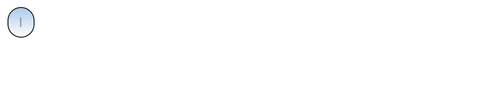

# react-type-carousel
A simple extendable ReactJS text carousel that includes styles that simulate typing/texting.

## Project

https://github.com/natashadecoste/react-typewriter-carousel

## Install

    npm i react-type-carousel

## Features
- fully extendable styling
- simple out-of-the box functionality
- different styles and animations

### Props

|Name|PropType | Default| Required
|--|--| --|--|
| data | Arrayof(String)  | null| Yes|
| width | String  | 100% | No|
| typeSpeed | Number  | 100 | No|
| chatStyle | Boolean  | false | No|

### Example
basic usage (only passing in an array of String items):

    <Typewriter data={data}/>

basic usage (with chat style turned on):

    <Typewriter chatStyle={true} data={data}></Typewriter>

